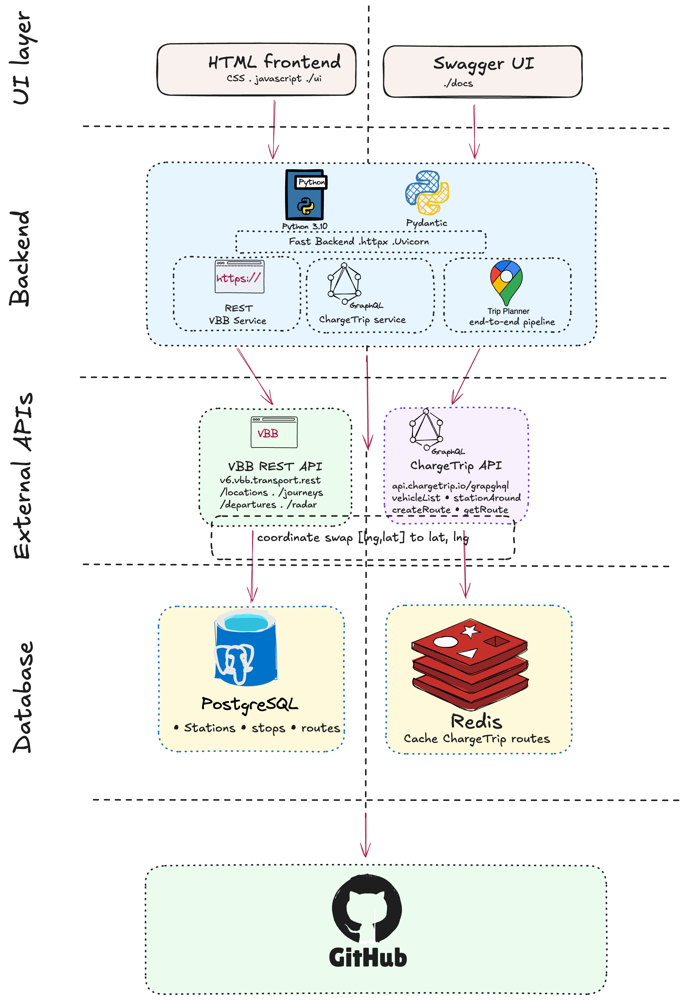

# EV Transit Planner API


A multimodal trip planner API combining VBB public transport and EV charging data for smart urban mobility in Berlin.

Built as part of the **Data Engineering for Smart and Sustainable Systems** course at INSA Hauts-de-France.

---

## What It Does

EV Transit Planner helps electric vehicle drivers plan smarter trips into Berlin by combining two data sources:

- **VBB API** — Berlin & Brandenburg public transport (S-Bahn, U-Bahn, buses, trams)
- **ChargeTrip API** — EV routing and charging station data

A user drives toward Berlin, stops at a charging station near a transit hub, then switches to public transport to reach the final destination. This reduces range anxiety while cutting car traffic in the city center.


---

## Why FastAPI Instead of Flask

This project uses **FastAPI** rather than Flask for several reasons:

**1. Async by default**
This API calls external services (VBB, ChargeTrip). FastAPI handles multiple requests simultaneously using async/await — while waiting for VBB to respond it can handle other requests. Flask is synchronous and blocks while waiting.

**2. Automatic documentation**
FastAPI generates interactive Swagger UI at `/docs` automatically from the code. No extra configuration needed. With Flask you would need to install and configure separate libraries.

**3. Built-in data validation**
FastAPI uses Pydantic models to validate every request and response. This is critical here because VBB responses contain nullable fields like `delay`, `when`, and `distance` that need careful handling.

**4. Industry standard for data APIs**
FastAPI has become the standard for building data and ML microservices in 2024-2026. It is used by Microsoft, Uber, Netflix, and NASA. For a data engineering project connecting multiple external APIs, FastAPI is the right tool.

**5. Type safety**
FastAPI uses Python type hints natively, making the code cleaner and easier to maintain.

---

## Tech Stack

| Layer | Technology |
|-------|-----------|
| Framework | FastAPI |
| Language | Python 3.10 |
| HTTP Client | httpx (async) |
| Validation | Pydantic |
| Server | Uvicorn |
| Testing | Pytest + pytest-asyncio |
| Docs | Swagger UI (auto-generated) |

---

**. Open Swagger docs**
http://localhost:8000/docs

---

## API Endpoints

| Method | Endpoint | Description |
|--------|----------|-------------|
| GET | `/api/locations/search` | Search stops by name |
| GET | `/api/locations/nearby` | Find stops near GPS coordinates |
| GET | `/api/departures/{stop_id}` | Real-time departures at a stop |
| GET | `/api/journeys` | Plan a journey from A to B |
| GET | `/api/radar` | Live vehicles in a geographic area |
| GET | `/api/reachable` | Stops reachable within X minutes |
| GET | `/api/v1/chargetrip/vehicles` | List available EV vehicles |
| GET | `/api/v1/chargetrip/stations` | Find charging stations near coordinates |
| POST | `/api/v1/chargetrip/routes` | Create an EV route calculation |
| GET | `/api/v1/chargetrip/routes/{id}` | Fetch a completed route result |
| GET | `/api/v1/planner/trip` | End-to-end multimodal trip planner |

---

## Data Sources

- **VBB REST API** — `https://v6.vbb.transport.rest`
  - No API key required
  - Covers Berlin & Brandenburg public transport
  - Real-time delays, cancellations, and disruptions
  - Rate limit: 100 requests/minute

- **ChargeTrip GraphQL API** — `https://api.chargetrip.io/graphql`
  - EV routing with charging stops
  - Vehicle consumption models
  - Charging station locations
  - Requires `x-client-id` and `x-app-id` headers

## System Architecture

The system follows a four-layer architecture connecting the FastAPI backend to both external APIs and (planned) database layer.



The critical integration point is the coordinate transformation: ChargeTrip returns `[longitude, latitude]` while VBB expects `latitude, longitude` as separate parameters.

## Frontend

A simple HTML/CSS/JS frontend is served at `/ui` for testing the trip planner interactively without Swagger.

```
http://localhost:8000/ui
```

